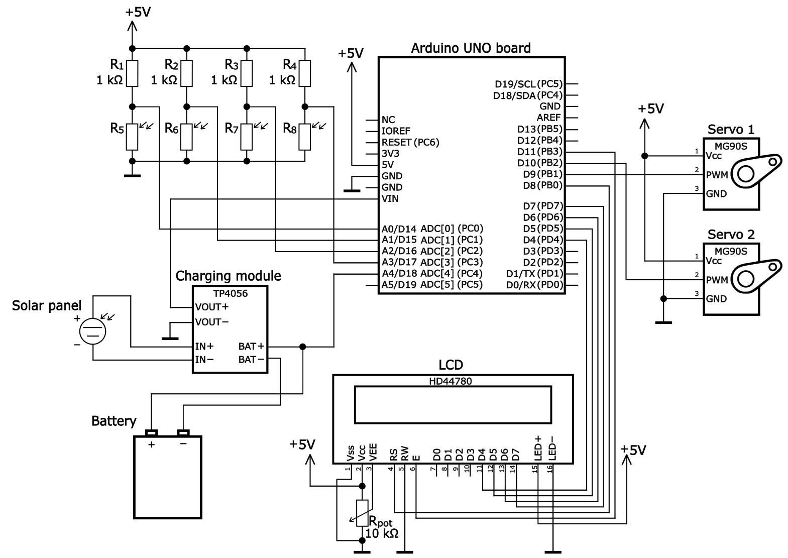
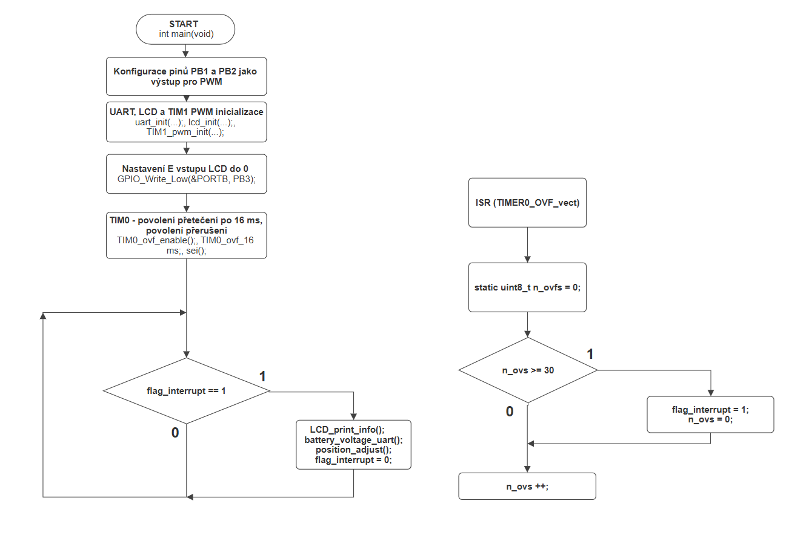
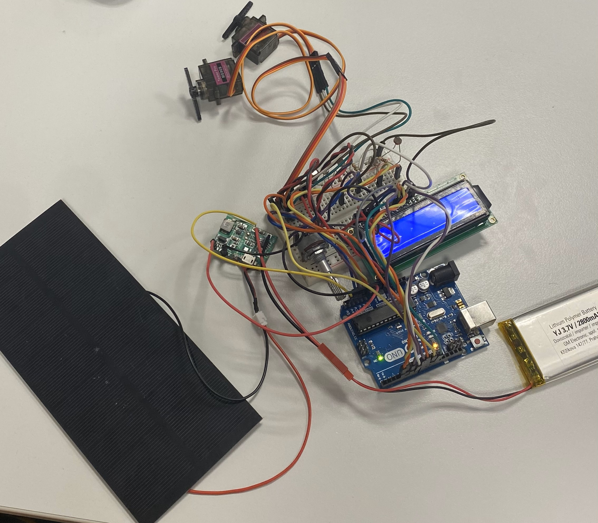

# Řešení semestrálního projektu z předmětu BPC-DE2

## Téma: Sledování parametrů a optimalizace solárního panelu

## Na projektu pracovali: 

* Matěj Matoušek (247142)
* Vojtěch Larva ()
* Petr Losert (247140)

## Hardwarové komponenty a schéma zapojení

* Vývojová deska Arduino UNO
* Nabíjecí modul TP4056 se step-up měničem
* LCD displej 2x16 znaků HD44780
* [Servo motory MG90S](#servo)
* Solární panel
* Li-ion baterie
* Elektronické součástky: čtyři fotorezistory, čtyři 1 kOhm rezistory, jeden 10 kOhm potenciometrický trimr

### Servo motory MG90S

  
### Popis zapojení komponent
Projekt je realizován na na vývojové desce Arduino UNO postavené na 8-bitovém mikrokontroleru ATmega328P z rodiny AVR. Schéma fyzického zapojení je vyobrazeno na obrázku níže. Zapojena jsou dvě serva MG90S, která jsou řízena PWM signálem z digitálních pinů PB1 a PB2. V zapojení je použit nabíjecí modul TP4056 se step-up měničem, který nabíjí Li-ion baterii připojenou na výstupech "BAT+" a "BAT-" modulu. Na vstup nabíjecího modulu je připojen solární panel, který dobíjí baterii. Výstupní napětí je poté přivedeno na Arduino UNO desku. Stav napětí baterie je snímán a zpracováván na pinu PC4. Piny PC0 až PC3 jsou přivedeny na odporový dělič, který se skládá z rezistorů o hodnotě 1 kOhm a fotorezistorů. Na těchto děličích je snímána o zpracovávána intenzita osvětlení fotorezistorů. K výstupnímu zobrazení je použit LCD displej HD44780, na kterém se zobrazují proměnné hodnoty udávající aktuální osvětlení a aktuální napětí baterie.        

  
Obrázek č. 2: Schéma zapojení 

## Popis programové části

### Popis běhu programu 
Ve funkci _int main(void){}_ nejprve nastavujeme piny pro PWM PB1 a PB2 jako výstupní. Poté probíhá inicializace UARTu, LCD displeje a nastavení časovače TIM1 pro PWM (_uart_init(...);_, _lcd_init(...);_,_TIM1_pwm_init();_). Následně nastavíme povolovací vstup LCD displeje E (Enable) na nulu, čímž displej povolíme. Časovač TIM0 je využit pro mechanizmus přerušení, kdy jeho přetečení je nastaveno na 16 ms. Jeho nastavení probíhá v řádcích _TIM0_ovf_enable();_ - povolení časovače, _TIM0_ovf_16ms();_ - přetečení po 16 ms a _sei();_ - globálně povolit přerušení. Dále je zapnut ADC převodník pro výčet vstupních analogových hodnot (_adc_init();_).  

V nekonečné smyčce (_while(1){}_) běží kód, kde jsou při podmínce setované vlajky  _flag_interrupt_ vykonány tři definované funkce: _LCD_print_info();_ - výpis údajů na LCD displej, _battery_voltage_uart();_ - posílání údaje o napětí akumulátoru do sériového monitoru, slouží pro ladění programu a _position_adjust();_ - slouží pro ovládání polohy servo motorů. Na konci podmínkového bloku je vlajka resetována.

Vektor přerušení je volán každých 16 ms při přetečení čítače a obsahuje proměnnou _n_ovs_ a podmínku, která zajišťuje nastavení vlajky za každých 30 x 16 ms, tedy přibližně půl minuty. Po jejím nastavení je splněna podmínka v nekonečné smyčce a jsou opět provedeny funkce pro obsaluhu displeje a ovládání servo motorů. Půlminutový interval slouží pro demo aplikaci, aby bylo vidět otáčení servo motorů, avšak v praxi by dostačoval interval řádově delší z důvodu pomalého pohybu slunce.   

Obrázek č. 3: Schéma zapojení

## Fotodokumentace a uživatelské ovládání
 
Obrázek č. 4: Fotografie zapojení

## Použité nástroje 
Inkscape - tvorba schémat  
SmartDraw - tvorba vývojových diagramů 

